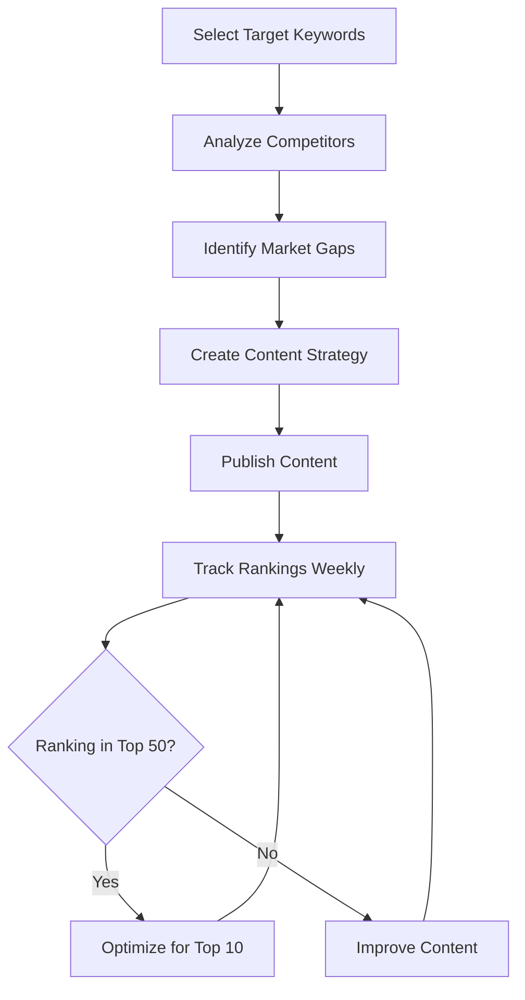
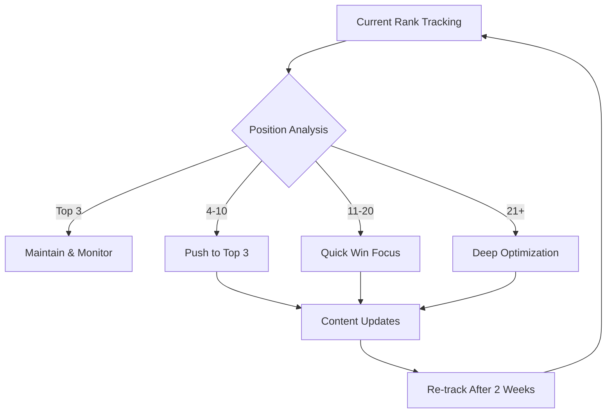

# 🎯 Rank Tracking & Competitor Analysis Guide

Complete guide for tracking keyword rankings and analyzing competitors using SerpAPI integration.

---

## 📋 Table of Contents

1. [Overview](#overview)
2. [Features](#features)
3. [API Endpoints](#api-endpoints)
4. [Rank Tracking](#rank-tracking)
5. [Competitor Analysis](#competitor-analysis)
6. [Use Cases](#use-cases)
7. [Example Workflows](#example-workflows)
8. [Automation](#automation)
9. [Troubleshooting](#troubleshooting)

---

## 🌟 Overview

The Rank Tracking & Competitor Analysis system allows you to:

- **Track Rankings**: Monitor your website's positions for target keywords
- **Analyze Competitors**: Identify who's ranking for your keywords
- **Market Intelligence**: Understand competitive landscape
- **Performance Metrics**: Get visibility scores and position distribution
- **Strategic Insights**: Receive actionable recommendations

**Requirements:**
- SerpAPI API Key (set in `SERPAPI_API_KEY` environment variable)
- Active SerpAPI subscription

---

## ✨ Features

### Rank Tracking Features

✅ **Multi-Keyword Tracking**
- Track unlimited keywords in a single request
- Support for any language (EN, DE, FR, IT, ES, etc.)
- Geographic location targeting

✅ **Comprehensive Metrics**
- Current position (1-100+)
- Page number (1-10+)
- Visibility score (weighted by position)
- Average position across all keywords
- Distribution (top 3, top 10, top 20, etc.)

✅ **Competitor Insights**
- Top 3 competitors for each keyword
- Their titles and URLs
- Position comparison

✅ **Smart Recommendations**
- Visibility improvement suggestions
- Content optimization tips
- Priority action items

### Competitor Analysis Features

✅ **Comprehensive Competitor Discovery**
- Identify all domains ranking for your keywords
- Track competitor frequency and positions
- Calculate visibility scores

✅ **Market Intelligence**
- Market concentration analysis
- Competition level assessment
- Top competitor dominance metrics

✅ **Strategic Insights**
- Content gap identification
- Backlink opportunities
- Competitive positioning

---

## 🔌 API Endpoints

### 1. Rank Tracking

**Endpoint:** `POST /serp/rank-tracking`

**Request:**
```json
{
  "domain": "bs-company.ch",
  "keywords": ["umzug zürich", "umzugsfirma zürich"],
  "location": "Switzerland",
  "language": "de"
}
```

**Response:**
```json
{
  "summary": {
    "domain": "bs-company.ch",
    "total_keywords_tracked": 2,
    "keywords_ranking": 1,
    "keywords_not_ranking": 1,
    "average_position": 15.0,
    "visibility_score": 25.0,
    "rankings_by_position": {
      "top_3": 0,
      "top_10": 0,
      "top_20": 1,
      "top_50": 1,
      "top_100": 1
    }
  },
  "rankings": [
    {
      "keyword": "umzug zürich",
      "position": 15,
      "url": "https://bs-company.ch/umzug",
      "title": "Umzug Zürich - BS Company",
      "snippet": "Professional moving services...",
      "status": "ranking",
      "page": 2,
      "top_competitors": [
        {
          "position": 1,
          "domain": "www.guenstigerumzug.ch",
          "title": "Günstiger Umzug Zürich",
          "url": "https://www.guenstigerumzug.ch"
        }
      ]
    }
  ],
  "recommendations": [
    "⚠️ Below average visibility - improve content and technical SEO",
    "📍 Average position 15.0 - target top 10 for better CTR"
  ]
}
```

### 2. Competitor Analysis

**Endpoint:** `POST /serp/competitor-analysis`

**Request:**
```json
{
  "domain": "bs-company.ch",
  "keywords": ["umzug zürich", "umzugsfirma zürich", "transport zürich"],
  "location": "Switzerland",
  "language": "de"
}
```

**Response:**
```json
{
  "your_domain": "bs-company.ch",
  "keywords_analyzed": 3,
  "total_competitors_found": 15,
  "top_competitors": [
    {
      "domain": "www.guenstigerumzug.ch",
      "appearances": 3,
      "visibility": 100.0,
      "avg_position": 2.3,
      "keywords_ranking": ["umzug zürich", "umzugsfirma zürich", "transport zürich"],
      "best_position": 1,
      "sample_urls": [
        "https://www.guenstigerumzug.ch/umzug-zuerich",
        "https://www.guenstigerumzug.ch/preise"
      ]
    }
  ],
  "competitive_landscape": {
    "market_concentration": "High",
    "average_competitor_visibility": 75.0,
    "average_competitor_position": 4.5,
    "competition_level": "Very High",
    "top_3_dominance": 85.0
  },
  "recommendations": [
    "🔴 Strong competitor: www.guenstigerumzug.ch (visibility: 100%)",
    "Study their content strategy and backlink profile"
  ]
}
```

---

## 📊 Rank Tracking

### Basic Usage

**cURL:**
```bash
curl -X POST http://localhost:8000/serp/rank-tracking \
  -H "Content-Type: application/json" \
  -d '{
    "domain": "your-domain.com",
    "keywords": ["keyword 1", "keyword 2"],
    "location": "United States",
    "language": "en"
  }'
```

**Python:**
```python
import requests

response = requests.post(
    "http://localhost:8000/serp/rank-tracking",
    json={
        "domain": "your-domain.com",
        "keywords": ["keyword 1", "keyword 2"],
        "location": "United States",
        "language": "en"
    }
)

data = response.json()
print(f"Visibility Score: {data['summary']['visibility_score']}")
print(f"Average Position: {data['summary']['average_position']}")
```

**JavaScript (Frontend):**
```javascript
const response = await fetch('/api/serp/rank-tracking', {
  method: 'POST',
  headers: { 'Content-Type': 'application/json' },
  body: JSON.stringify({
    domain: 'your-domain.com',
    keywords: ['keyword 1', 'keyword 2'],
    location: 'United States',
    language: 'en'
  })
});

const data = await response.json();
console.log('Visibility:', data.summary.visibility_score);
```

### Understanding Visibility Score

The visibility score is a weighted metric (0-100) based on position:

| Position | Score | Explanation |
|----------|-------|-------------|
| 1 | 100 | #1 position - maximum visibility |
| 2-3 | 80 | Top 3 - high visibility |
| 4-10 | 50 | First page - good visibility |
| 11-20 | 25 | Second page - low visibility |
| 21-100 | 10 | Deep pages - minimal visibility |
| Not found | 0 | No ranking |

**Example Calculation:**
- Keyword A: Position 1 → 100 points
- Keyword B: Position 5 → 50 points
- Keyword C: Not ranking → 0 points
- **Average Visibility: (100 + 50 + 0) / 3 = 50.0**

### Multi-Language Support

**German (Switzerland):**
```json
{
  "domain": "meine-firma.ch",
  "keywords": ["umzug zürich", "günstige umzugsfirma"],
  "location": "Switzerland",
  "language": "de"
}
```

**French (Switzerland):**
```json
{
  "domain": "ma-entreprise.ch",
  "keywords": ["déménagement genève", "entreprise de déménagement"],
  "location": "Switzerland",
  "language": "fr"
}
```

**Turkish:**
```json
{
  "domain": "sirketim.com.tr",
  "keywords": ["istanbul nakliyat", "evden eve nakliyat"],
  "location": "Turkey",
  "language": "tr"
}
```

---

## 🏆 Competitor Analysis

### Basic Usage

**cURL:**
```bash
curl -X POST http://localhost:8000/serp/competitor-analysis \
  -H "Content-Type: application/json" \
  -d '{
    "domain": "your-domain.com",
    "keywords": ["target keyword 1", "target keyword 2"],
    "location": "United States",
    "language": "en"
  }'
```

**Python:**
```python
import requests

response = requests.post(
    "http://localhost:8000/serp/competitor-analysis",
    json={
        "domain": "your-domain.com",
        "keywords": ["target keyword 1", "target keyword 2"],
        "location": "United States",
        "language": "en"
    }
)

data = response.json()

# Print top 5 competitors
for comp in data['top_competitors'][:5]:
    print(f"{comp['domain']}: {comp['visibility']}% visibility, avg pos {comp['avg_position']}")
```

### Understanding Competitor Metrics

**Visibility Score:**
- Percentage of keywords the competitor ranks for
- 100% = ranks for all analyzed keywords
- 50% = ranks for half of analyzed keywords

**Average Position:**
- Mean position across all keywords they rank for
- Lower is better (1.0 = perfect #1 positions)

**Appearances:**
- Number of keywords they appear in top 10 for

**Market Concentration:**
- **High**: Top 3 competitors dominate (>60% visibility)
- **Medium**: Competition is balanced (40-60%)
- **Low**: Fragmented market (<40%)

### Competitive Landscape Analysis

```json
{
  "competitive_landscape": {
    "market_concentration": "High",
    "average_competitor_visibility": 75.0,
    "average_competitor_position": 4.5,
    "competition_level": "Very High",
    "top_3_dominance": 85.0
  }
}
```

**Interpretation:**
- **Market Concentration: High** → A few players dominate
- **Top 3 Dominance: 85%** → Top 3 competitors are very strong
- **Competition Level: Very High** → Difficult to compete
- **Strategy**: Focus on long-tail keywords, build topical authority

---

## 💡 Use Cases

### Use Case 1: Monthly Rank Tracking

**Goal:** Monitor monthly progress for target keywords

**Setup:**
```bash
# Create a cron job that runs monthly
0 0 1 * * /path/to/rank_tracking_script.sh
```

**Script:**
```bash
#!/bin/bash
DATE=$(date +%Y-%m)
curl -X POST http://localhost:8000/serp/rank-tracking \
  -H "Content-Type: application/json" \
  -d '{
    "domain": "your-domain.com",
    "keywords": ["keyword1", "keyword2", "keyword3"]
  }' > "rankings_${DATE}.json"
```

### Use Case 2: Competitive Intelligence

**Goal:** Identify new competitors entering your space

**Strategy:**
1. Run competitor analysis weekly
2. Track new domains appearing in top 10
3. Analyze their content strategy
4. Adjust your SEO tactics

### Use Case 3: Keyword Prioritization

**Goal:** Focus on keywords with best ROI potential

**Approach:**
```python
import requests

# Get current rankings
rankings = requests.post(
    "http://localhost:8000/serp/rank-tracking",
    json={"domain": "your-domain.com", "keywords": keywords}
).json()

# Prioritize keywords on page 2 (positions 11-20)
page_2_keywords = [
    r for r in rankings['rankings'] 
    if r['position'] and 11 <= r['position'] <= 20
]

print("Quick Win Opportunities (Page 2):")
for kw in page_2_keywords:
    print(f"  - {kw['keyword']}: Position {kw['position']}")
```

### Use Case 4: SERP Feature Opportunities

**Goal:** Identify keywords where you can win featured snippets

**Analysis:**
```python
# Check which keywords have featured snippets
# and where you rank
for ranking in rankings['rankings']:
    if ranking['position'] and ranking['position'] <= 10:
        # Analyze if featured snippet exists
        # Optimize content for snippet
        pass
```

---

## 🔄 Example Workflows

### Workflow 1: New Website Launch



**Implementation:**
```bash
# Step 1: Competitor Analysis
curl -X POST /serp/competitor-analysis -d '{"domain": "new-site.com", ...}'

# Step 2: Weekly Rank Tracking
# Create cron: 0 0 * * 1 (every Monday)
curl -X POST /serp/rank-tracking -d '{"domain": "new-site.com", ...}'
```

### Workflow 2: Existing Website Optimization



### Workflow 3: Competitive Content Gap Analysis

**Step 1: Identify Common Keywords**
```python
# Get competitor analysis
comp_data = analyze_competitors(domain, keywords)

# Find keywords where competitors rank but you don't
for comp in comp_data['top_competitors']:
    competitor_keywords = set(comp['keywords_ranking'])
    your_keywords = set(your_rankings)
    gaps = competitor_keywords - your_keywords
    print(f"Content gaps vs {comp['domain']}: {gaps}")
```

**Step 2: Create Targeted Content**
- Research competitor content depth
- Identify their backlink sources
- Create comprehensive, better content

**Step 3: Track Progress**
- Monitor new content rankings
- Adjust based on performance

---

## 🤖 Automation

### Daily Rank Tracking (Cron)

**Create script:** `daily_rank_check.sh`
```bash
#!/bin/bash
DOMAIN="your-domain.com"
KEYWORDS='["keyword1", "keyword2", "keyword3"]'
DATE=$(date +%Y-%m-%d)

curl -X POST http://localhost:8000/serp/rank-tracking \
  -H "Content-Type: application/json" \
  -d "{
    \"domain\": \"${DOMAIN}\",
    \"keywords\": ${KEYWORDS},
    \"location\": \"United States\"
  }" > "/var/log/rankings/rank_${DATE}.json"

# Check for significant changes
python3 /path/to/alert_if_change.py "/var/log/rankings/rank_${DATE}.json"
```

**Add to crontab:**
```bash
# Run daily at 6 AM
0 6 * * * /path/to/daily_rank_check.sh
```

### Weekly Competitor Monitoring (n8n)

**n8n Workflow:**
```json
{
  "nodes": [
    {
      "name": "Schedule Trigger",
      "type": "n8n-nodes-base.cron",
      "parameters": {
        "cronExpression": "0 0 * * 1"
      }
    },
    {
      "name": "Rank Tracking",
      "type": "n8n-nodes-base.httpRequest",
      "parameters": {
        "url": "http://api:8000/serp/rank-tracking",
        "method": "POST",
        "body": {
          "domain": "your-domain.com",
          "keywords": ["keyword1", "keyword2"]
        }
      }
    },
    {
      "name": "Competitor Analysis",
      "type": "n8n-nodes-base.httpRequest",
      "parameters": {
        "url": "http://api:8000/serp/competitor-analysis",
        "method": "POST"
      }
    },
    {
      "name": "Send Email Report",
      "type": "n8n-nodes-base.emailSend"
    }
  ]
}
```

### Slack Notifications

**Python script:**
```python
import requests

def send_rank_alert(rankings):
    summary = rankings['summary']
    
    # Check for significant changes
    if summary['visibility_score'] < 30:
        alert = f"🚨 Low visibility alert: {summary['visibility_score']}"
    elif summary['top_3_count'] > 0:
        alert = f"🎉 {summary['top_3_count']} keywords in top 3!"
    
    # Send to Slack
    requests.post(
        SLACK_WEBHOOK_URL,
        json={"text": alert}
    )
```

---

## 🐛 Troubleshooting

### Issue 1: "SERPAPI_API_KEY not set"

**Solution:**
```bash
# Add to .env file
echo "SERPAPI_API_KEY=your_api_key_here" >> .env

# Restart API
docker compose restart api
```

### Issue 2: Domain Not Found

**Possible Causes:**
1. Domain not ranking in top 100
2. Different domain format (www vs non-www)
3. Wrong location/language setting

**Debug:**
```bash
# Test with known ranking domain
curl -X POST /serp/rank-tracking -d '{
  "domain": "example.com",
  "keywords": ["example"]
}'
```

### Issue 3: Rate Limiting

**Error:** "429 Too Many Requests"

**Solution:**
- Check SerpAPI usage: https://serpapi.com/account
- Upgrade plan or reduce request frequency
- Implement caching for repeated queries

### Issue 4: Slow Response Time

**Causes:**
- Multiple keywords = multiple API calls
- SerpAPI rate limits

**Optimization:**
```python
# Batch keywords in groups of 10
keywords_batches = [keywords[i:i+10] for i in range(0, len(keywords), 10)]

for batch in keywords_batches:
    track_keyword_ranking(domain, batch)
    time.sleep(2)  # Rate limit protection
```

---

## 📈 Best Practices

### 1. Keyword Selection

✅ **Do:**
- Focus on business-critical keywords
- Include brand keywords
- Track long-tail variations
- Mix different intent types (commercial, informational)

❌ **Don't:**
- Track 100+ keywords daily (expensive)
- Ignore search volume (track valuable keywords)
- Forget mobile vs desktop rankings

### 2. Tracking Frequency

| Keyword Type | Frequency | Reason |
|--------------|-----------|--------|
| Brand keywords | Daily | Monitor brand protection |
| Money keywords | Weekly | Track revenue impact |
| Informational | Bi-weekly | Slower ranking changes |
| Long-tail | Monthly | Lower priority |

### 3. Competitive Analysis

✅ **Analyze:**
- Top 10 competitors for each keyword
- Their content depth and quality
- Backlink profiles (use MOZ integration)
- Technical SEO factors

✅ **Action:**
- Create content gap analysis
- Identify quick win opportunities
- Build similar (or better) backlinks

### 4. Data Storage

**Recommendation:** Store historical data in Supabase

```sql
CREATE TABLE rank_tracking_history (
  id BIGSERIAL PRIMARY KEY,
  domain TEXT NOT NULL,
  keyword TEXT NOT NULL,
  position INTEGER,
  url TEXT,
  visibility_score DECIMAL(5,2),
  tracked_at TIMESTAMPTZ DEFAULT NOW(),
  location TEXT,
  language TEXT,
  competitors JSONB
);

CREATE INDEX idx_rank_tracking_domain_keyword 
  ON rank_tracking_history(domain, keyword, tracked_at DESC);
```

---

## 🎯 Next Steps

1. **Test the API:**
   ```bash
   ./test_rank_tracking.sh
   ```

2. **Set Up Monitoring:**
   - Create weekly cron job
   - Configure Slack alerts
   - Set up Supabase storage

3. **Analyze Competitors:**
   - Identify top 10 competitors
   - Analyze their content strategy
   - Find content gaps

4. **Optimize:**
   - Focus on page 2 keywords (positions 11-20)
   - Improve content for top 10 keywords
   - Target featured snippet opportunities

5. **Scale:**
   - Add more keywords
   - Track multiple domains
   - Automate reporting

---

## 📚 Additional Resources

- [SerpAPI Documentation](https://serpapi.com/docs)
- [SEO Best Practices](./SEO_ANALYZER_GUIDE.md)
- [MOZ Integration Guide](./MOZ_INTEGRATION.md)
- [SerpAPI Integration Guide](./SERPAPI_INTEGRATION.md)

---

**Need Help?**
- Check [Troubleshooting](#troubleshooting) section
- Review API response errors
- Test with simple keywords first
- Verify SerpAPI quota: https://serpapi.com/account

Happy Tracking! 🚀📊
